# Allien (DockerLabs)


La máquina **Alien** es una máquina de nivel fácil de DockerLabs en la que hemos utilizado técnicas como:

- **Enumeración de usuarios** con `enum4linux`.
- **Fuzzing de directorios** con `Gobuster`.
- **Explotación de Samba** con `CrackMapExec`, `smbmap` y `smbclient`.
- **Escalada de privilegios** con `sudo`.

## Enumeración

Empezamos la enumeración de la maquina con un escaneo de puertos abiertos, servicios y posibles vulneravilidades con nmap.

```perl
# Nmap 7.95 scan initiated Wed Mar 26 06:29:56 2025 as: /usr/lib/nmap/nmap -p- --open -sVC --min-rate 3000 -n -Pn -oN escaneo 172.17.0.2
Nmap scan report for 172.17.0.2
Host is up (0.0000020s latency).
Not shown: 65531 closed tcp ports (reset)
PORT    STATE SERVICE     VERSION
22/tcp  open  ssh         OpenSSH 9.6p1 Ubuntu 3ubuntu13.5 (Ubuntu Linux; protocol 2.0)
| ssh-hostkey: 
|   256 43:a1:09:2d:be:05:58:1b:01:20:d7:d0:d8:0d:7b:a6 (ECDSA)
|_  256 cd:98:0b:8a:0b:f9:f5:43:e4:44:5d:33:2f:08:2e:ce (ED25519)
80/tcp  open  http        Apache httpd 2.4.58 ((Ubuntu))
|_http-title: Login
|_http-server-header: Apache/2.4.58 (Ubuntu)
139/tcp open  netbios-ssn Samba smbd 4
445/tcp open  netbios-ssn Samba smbd 4
MAC Address: 02:42:AC:11:00:02 (Unknown)
Service Info: OS: Linux; CPE: cpe:/o:linux:linux_kernel

Host script results:
| smb2-time: 
|   date: 2025-03-26T10:30:08
|_  start_date: N/A
|_nbstat: NetBIOS name: SAMBASERVER, NetBIOS user: <unknown>, NetBIOS MAC: <unknown> (unknown)
| smb2-security-mode: 
|   3:1:1: 
|_    Message signing enabled but not required

Service detection performed. Please report any incorrect results at https://nmap.org/submit/ .
# Nmap done at Wed Mar 26 06:30:08 2025 -- 1 IP address (1 host up) scanned in 12.14 seconds
```

El escaneo nos muestra 4 puertos abiertos:

- **22/tcp** → **SSH** (OpenSSH 9.6p1, Ubuntu)
- **80/tcp** → **HTTP** (Apache 2.4.58, muestra una página de **Login**)
- **139/tcp y 445/tcp** → **Samba** (SMB compartiendo archivos)

Nos vamos al navegador a echar un vistazo a la web, solo se  muestra un panel de login.

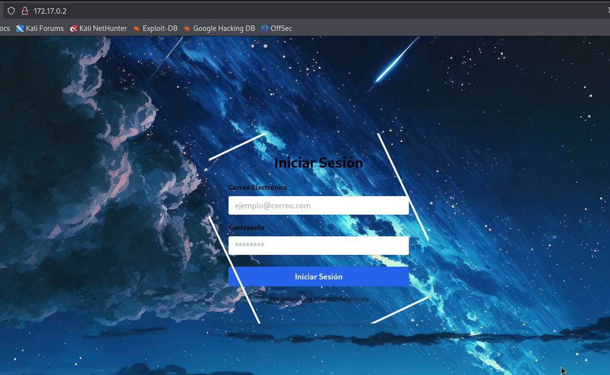

Hacemos un poco de fuzzing para mostrar directorios ocultos de la web Gobuster nos muestra 3 directorios mas.

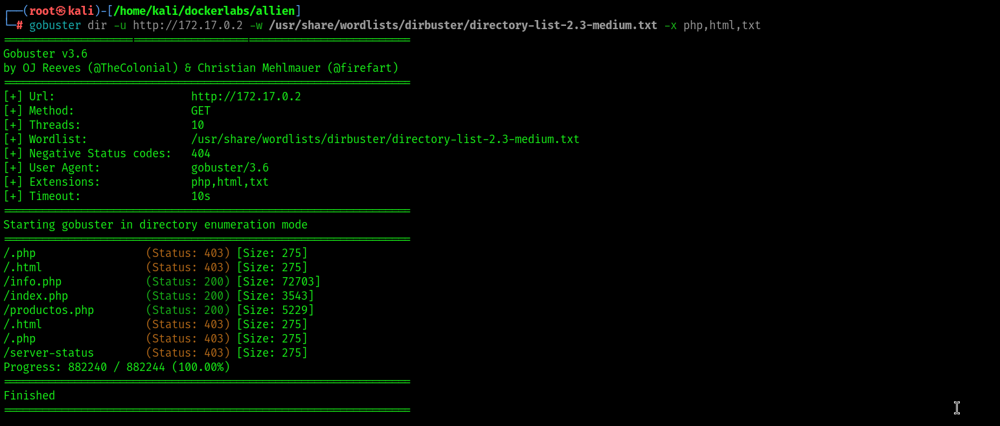

Revisamos los directorios pero no parece que haya nada interesante.

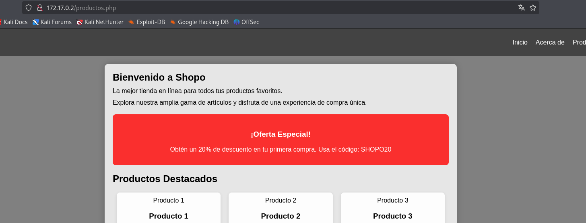

Dado que de momento no disponemos de ninguna credencial usaremos `enum4linux` para sacar posibles usuarios de Samba y nos saca varios posibles usuarios .

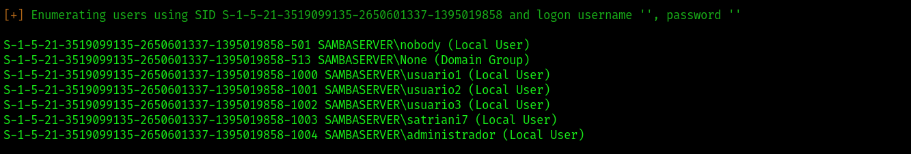

Usamos `crackmapexec` para intentar sacar la contraseña de `satriani7`

`crackmapexec smb 172.17.0.2 -u satriani7  -p /usr/share/wordlists/rockyou.txt`

Encontramos su password.

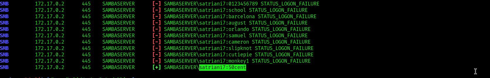

## Explotación de Samba

Ya con credenciales validas usamos `smbmap` para enumerar archivos compartidos a los cuales tengamos acceso.

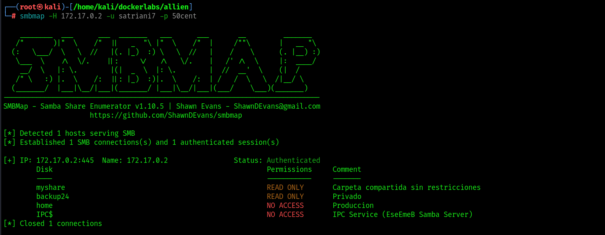

Encontramos dos archivos interesantes que podemos leer llamados myshare y backup24, miraremos su contenido con `smbclient`

`smbclient [//172.17.0.2/backup24](https://172.17.0.2/backup24) -U satriani7`

Encontramos un archivo llamado credentials.txt, nos lo llevamos para ver su contenido.

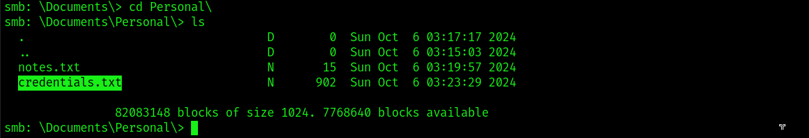

El archivo contiene infinidad de credenciales pero nos quedamos con las de `administrador` ya que ya vimos en el escaneo de `enum4linux` que es usuario de samba.

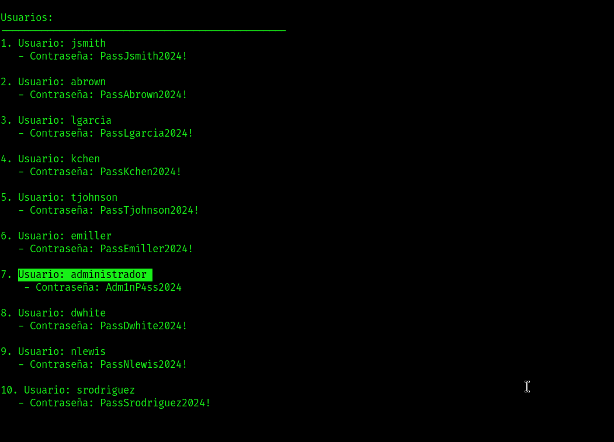

Usamos `smbmap` para ver los recursos a los que tenemos acceso.

Tenemos el directorio `home` al que tenemos acceso y podemos leer y escribir.

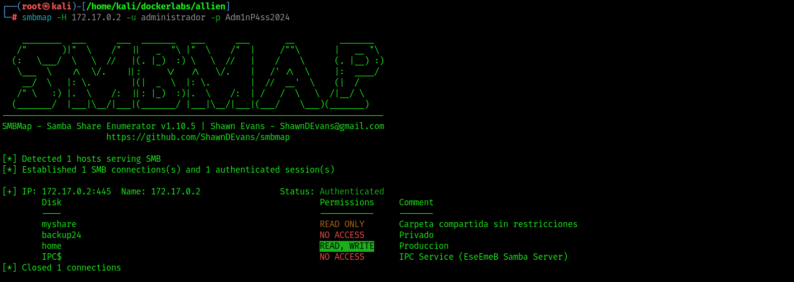

Usamos `smbclient` para ver su contenido y se trata del directorio web.

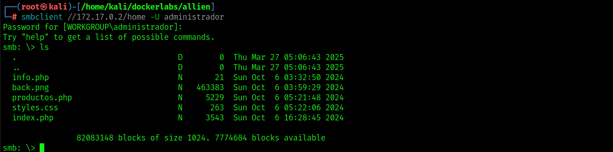

Si podemos subir una reverse shell podremos conectarnos al servidor.

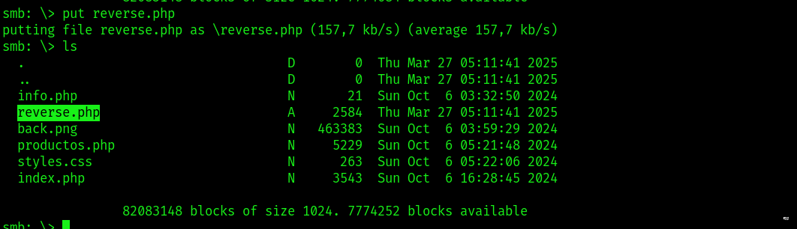

Ponemos `netcat` en escucha y nos vamos al navegador a buscar nuestra reverse shell.

Conseguimos acceso como `www-data`.

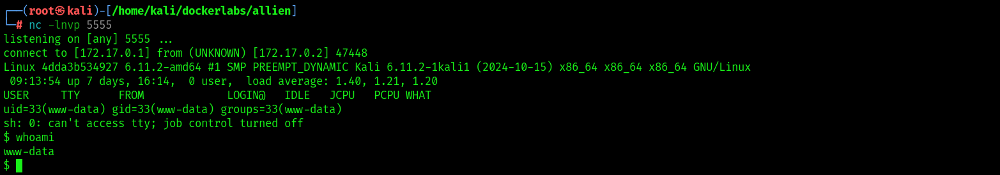

## Escalada de privilegios

Hacemos el tratamiento de la tty y intentamos la escalada con sudo.

Podemos ejecutar service como root.

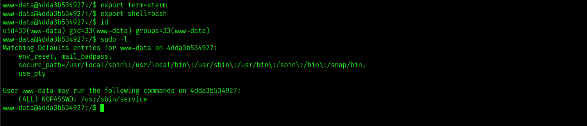

el la pagina `gtfobins` nos indica como hacer la escalada con un simple comando. Ya somos `root.` 

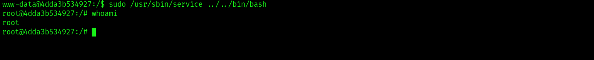
