Chocolatefire de dockerlabs es una maquina medium con varias maneras de resolverla, personalmente yo hice una mezcla de las dos maneras porque una vez ya tenia acceso , me estanque en la escalada de privilegios y tire cor otro lado.

## Enumeración

Empezamos con un escaneo de puertos y versiones con nmap.

```bash
# Nmap 7.95 scan initiated Thu Mar 20 06:18:10 2025 as: /usr/lib/nmap/nmap -p- --open -sVC --min-rate 3000 -n -Pn -oN escaneos 172.17.0.2
Nmap scan report for 172.17.0.2
Host is up (0.0000030s latency).
Not shown: 65523 closed tcp ports (reset)
PORT     STATE SERVICE         VERSION
22/tcp   open  ssh             OpenSSH 8.4p1 Debian 5+deb11u3 (protocol 2.0)
| ssh-hostkey: 
|   3072 9c:7c:e5:ea:fe:ac:f5:bc:21:54:87:66:70:ed:df:75 (RSA)
|   256 b2:1a:b1:05:0e:7e:94:18:98:19:8f:60:d7:04:7a:1c (ECDSA)
|_  256 c1:81:ba:4f:1a:99:9f:32:10:4a:6a:d9:f4:aa:40:de (ED25519)
5222/tcp open  jabber          Ignite Realtime Openfire Jabber server 3.10.0 or later
|_ssl-cert: ERROR: Script execution failed (use -d to debug)
| xmpp-info: 
|   STARTTLS Failed
|   info: 
|     stream_id: 5alc0rin27
|     features: 
|     auth_mechanisms: 
|     capabilities: 
|     unknown: 
|     compression_methods: 
|     errors: 
|       invalid-namespace
|       (timeout)
|     xmpp: 
|_      version: 1.0
5223/tcp open  ssl/hpvirtgrp?
|_ssl-date: TLS randomness does not represent time
5262/tcp open  jabber
| xmpp-info: 
|   STARTTLS Failed
|   info: 
|     stream_id: 9vt1afs9vt
|     features: 
|     auth_mechanisms: 
|     capabilities: 
|     unknown: 
|     compression_methods: 
|     errors: 
|       invalid-namespace
|       (timeout)
|     xmpp: 
|_      version: 1.0
| fingerprint-strings: 
|   RPCCheck: 
|_    <stream:error xmlns:stream="http://etherx.jabber.org/streams"><not-well-formed xmlns="urn:ietf:params:xml:ns:xmpp-streams"/></stream:error></stream:stream>
5263/tcp open  ssl/unknown
|_ssl-date: TLS randomness does not represent time
5269/tcp open  xmpp            Wildfire XMPP Client
| xmpp-info: 
|   STARTTLS Failed
|   info: 
|     features: 
|     auth_mechanisms: 
|     capabilities: 
|     unknown: 
|     compression_methods: 
|     errors: 
|       (timeout)
|_    xmpp: 
5270/tcp open  xmp?
5275/tcp open  jabber          Ignite Realtime Openfire Jabber server 3.10.0 or later
| xmpp-info: 
|   STARTTLS Failed
|   info: 
|     stream_id: 9sxqlvonc8
|     features: 
|     auth_mechanisms: 
|     capabilities: 
|     unknown: 
|     compression_methods: 
|     errors: 
|       invalid-namespace
|       (timeout)
|     xmpp: 
|_      version: 1.0
5276/tcp open  ssl/unknown
|_ssl-date: TLS randomness does not represent time
7070/tcp open  http            Jetty
|_http-title: Openfire HTTP Binding Service
7777/tcp open  socks5          (No authentication; connection not allowed by ruleset)
| socks-auth-info: 
|_  No authentication
9090/tcp open  hadoop-datanode Apache Hadoop
| hadoop-datanode-info: 
|_  Logs: jive-ibtn jive-btn-gradient
|_http-title: Site doesn't have a title (text/html).
| hadoop-tasktracker-info: 
|_  Logs: jive-ibtn jive-btn-gradient
1 service unrecognized despite returning data. If you know the service/version, please submit the following fingerprint at https://nmap.org/cgi-bin/submit.cgi?new-service :
SF-Port5262-TCP:V=7.95%I=7%D=3/20%Time=67DBEB7C%P=x86_64-pc-linux-gnu%r(RP
SF:CCheck,9B,"<stream:error\x20xmlns:stream=\"http://etherx\.jabber\.org/s
SF:treams\"><not-well-formed\x20xmlns=\"urn:ietf:params:xml:ns:xmpp-stream
SF:s\"/></stream:error></stream:stream>");
MAC Address: 02:42:AC:11:00:02 (Unknown)
Service Info: OS: Linux; CPE: cpe:/o:linux:linux_kernel

Service detection performed. Please report any incorrect results at https://nmap.org/submit/ .
# Nmap done at Thu Mar 20 06:21:03 2025 -- 1 IP address (1 host up) scanned in 173.19 seconds
```

Tenemos:

- **Puerto 22 (SSH)**: Está abierto y usa **OpenSSH 8.4p1** en Debian. Se permite la autenticación mediante **RSA**, **ECDSA** y **ED25519**.
- **Puertos 5222, 5262, 5269, 5275 (XMPP/Jabber)**: Están relacionados con **Ignite Openfire/Wildfire**. Hay problemas en la conexión segura **STARTTLS** y fallos en la autenticación.
- **Puerto 7070 (HTTP)**: Está corriendo el servicio **Jetty** para el **HTTP Binding** de **Openfire**.
- **Puerto 7777 (SOCKS5)**: Es un servicio de **proxy abierto**, lo que significa que cualquiera podría usarlo sin necesidad de autenticarse.
- **Puerto 9090 (Hadoop TaskTracker)**: Tiene un panel web sin título, lo que podría ser parte de **Apache Hadoop**.

Como tiene infinidad de puertos abiertos empezamos con los HTTP para ver que hay.

En el 7070 ya nos da alguna pista de lo que realmente esta corriendo por aqui que es un servicio openfire.

**Openfire** es un servidor de mensajería instantánea de código abierto  basado en el protocolo **XMPP** (Jabber). Permite a los usuarios enviar mensajes en tiempo real y se usa principalmente para chat en equipos o aplicaciones.

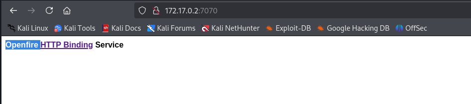


En el escaneo vimos que existía un panel de login en el puerto 9090, así que vamos para allí.

La sorpresa es que al probar el login por defecto del panel conseguimos acceso `admin:admin`.

## Explotación (1)

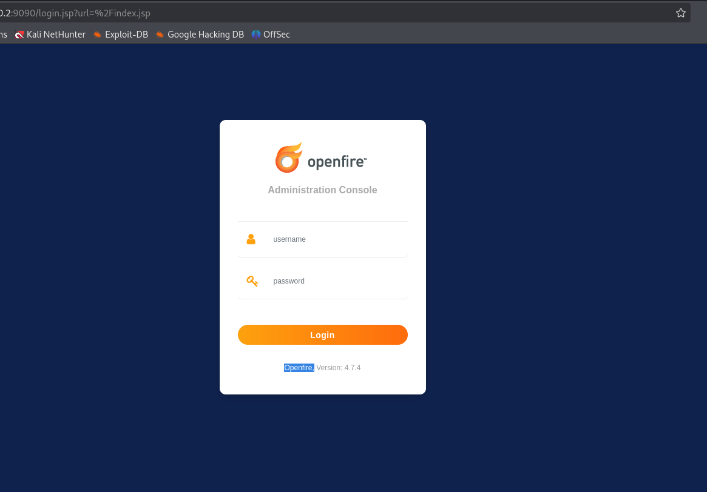

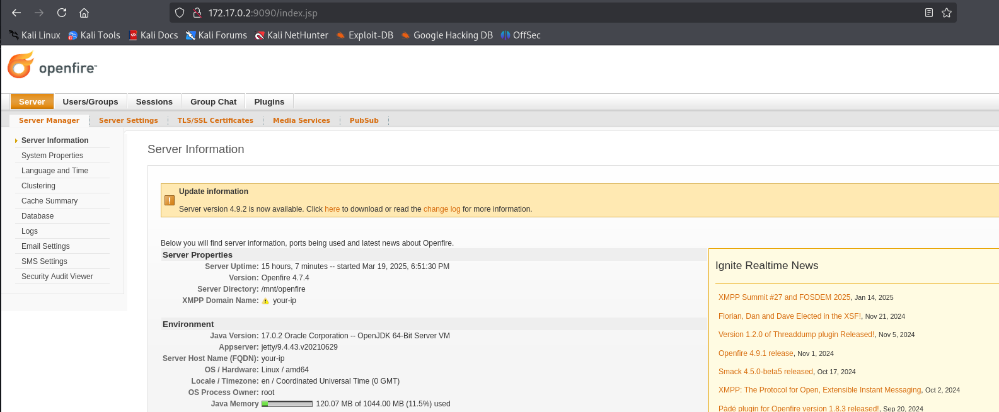

Dentro del panel de control existe una zona donde se encuentran los usuarios.

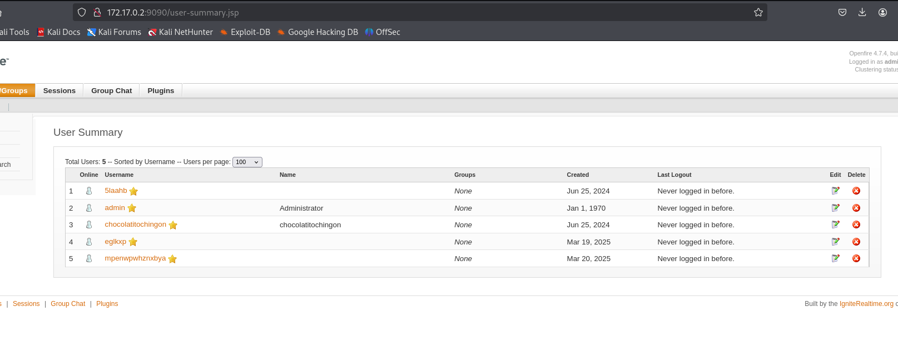

Con ya potenciales usuarios por la mano intentamos fuerza bruta para sacar posibles contraseñas de SSH, conseguimos la de chocolatitochingon.

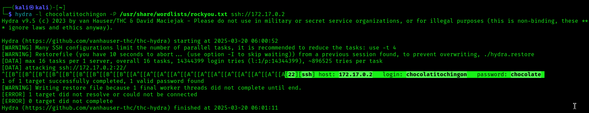

Nos conectamos por SSH.

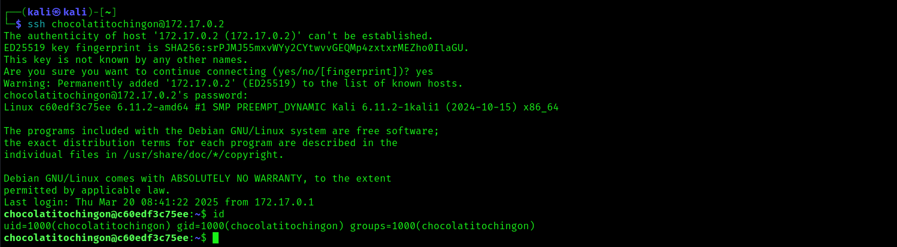

En el servidor existen dos usuarios, el nuestro y otro llamado pinguinacio.

### Pivoting entre usuarios

Ejecutamos sudo -l para comprobar si nuestro usuario tiene algún privilegio.

Podemos ejecutar dpkg como pinguinacio, dpkg es una herramienta de gestión de paquetes en sistemas Debian, con la flag -l pobremos listar todos los paquetes.

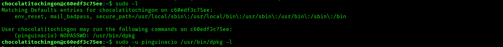

Al listar los paquetes se nos brinda la posibilidad de colar un comando para abrir un shell como pinguinacio.

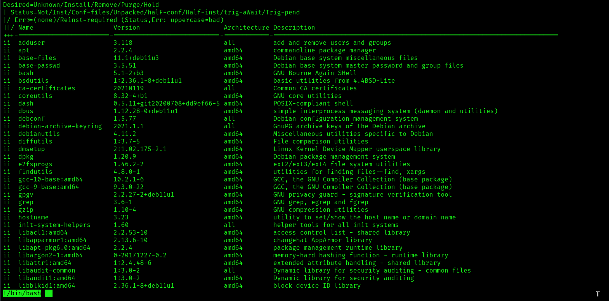

Una vez como usuario pinguinacio, entramos en su carpeta y vemos un script interesante.

```bash
#!/bin/bash

read -rp "Ingrese el número 1 para hacer un backup de tus archivos: " numero

if [[ "$numero" -eq 1 ]]
then
    echo "El número ingresado es igual a 1"
    echo "Intentando copiar archivos al directorio /opt..."
    cp * /opt
    echo "Copia completada."
else
    echo "El número ingresado no es igual a 1. No se realizará ninguna operación."
fi
```

## Escalada de privilegios usando el script.sh

Este script pide al usuario que ingrese el número 1 para hacer un backup de sus archivos. Si el número ingresado es 1, copia todos los archivos del directorio actual al directorio `/opt.` Si no se ingresa el número 1, no realiza ninguna acción, lo interesante es que esta escrito por `root.`

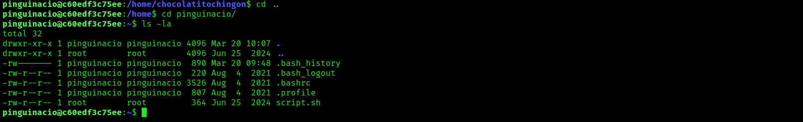

Este script podria ser una buena escalada de privilegios hacia root, ejecutamos el comando sudo -l y nos lo confirma.

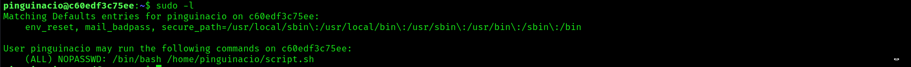

Llegados a este punto reconozco que me estanque y no supe como explotar este script vulnerable, tiré hacia atrás y me fui a metasploit (después explicaré que hice) pero tirando de writeup vi la manera de explotarlo y me pareció muy interesante así que la probé.

El script tiene una vulnerabilidad en la  línea `if [[ "$numero" -eq 1 ]]`, un  arbitrary command injection  ya que que el valor ingresado por el usuario no se valida adecuadamente, lo que permite que un atacante pueda inyectar comandos de shell dentro de la variable `$numero`.

En esta pagina te indican como explotarlo:

https://exploit-notes.hdks.org/exploit/linux/privilege-escalation/bash-eq-privilege-escalation/

Este script te pide que pongas un número. Si pones el número 1, dice “El número ingresado es igual a 1" y copia los archivos a `/opt`, si pones cualquier otro número, dice "El número ingresado no es igual a 1. No se realizará ninguna operación". Hasta aquí todo normal.

Ahora, si eres capaz de ejecutar este script como `root`**,** como es en este caso, puedes inyectar esto `a[$(whoami >&2)]+1` Esto hará que el script ejecute el comando `whoami,` pero también sigue haciendo la comparación con el número 1.

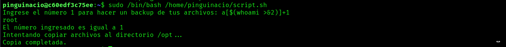

Así que si en lugar de poner un comando inofensivo como whoami, le inyectamos un /bin/bash, nos abrirá un shell como root.Esta sería la inyección a[$(/bin/bash >&2)]+1

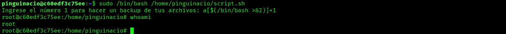

## Explotación y escalada usando Metasploit

Una vez estancada en la escalada de privilegios decidí volver atrás y buscar algún exploit en  Metasploit para openfire y lo había.

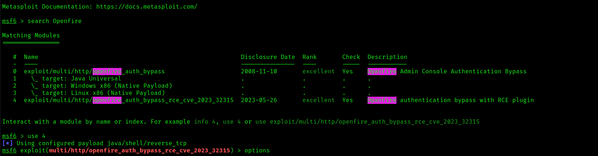

Se trataba de un exploit muy actual y con calificación excelente. Usamos el 4.

Configuramos todas las opciones, simplemente las IP’s.

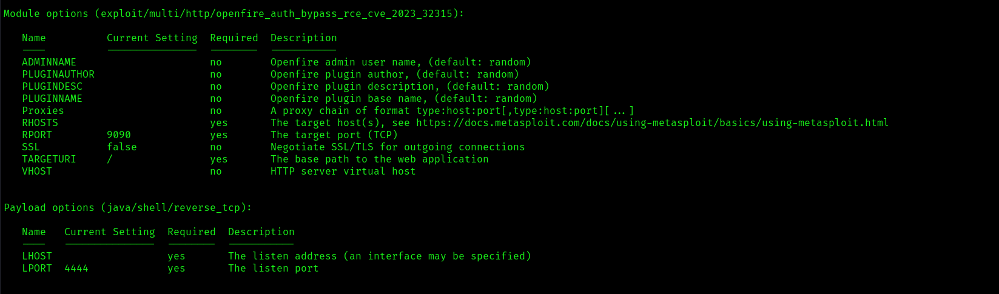


E iniciamos el exploit, directamente nos convertimos en root.

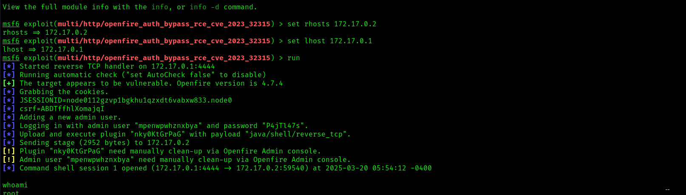


Así que, mi reflexión sobre esta máquina es que si se hace con metasploit es una maquina fácil tirando a muy fácil, teniendo las credenciales por defecto en el panel de control que nos permite leer los usuarios se convierte en fácil sin, sin credenciales por defecto seria como dice un nivel medium. 
