# Domain (Dockerlabs)

Creado: 19 de marzo de 2025 17:26

Esta es la primera máquina que pruebo en DockerLabs. Conocía la plataforma, pero nunca la había utilizado. DockerLabs ofrece un entorno seguro para practicar con máquinas vulnerables dentro de contenedores Docker, lo que lo hace menos invasivo para nuestro equipo en comparación con la descarga de máquinas virtuales. Es una herramienta muy fácil de usar, con una gran variedad de máquinas y niveles de dificultad.

He empezado con esta maquina llamada Domain creada por el creador de la plataforma el Pingüino de Mario, en la plataforma pone que es de nivel medio pero diría que es mas tirando a fácil.

Las técnicas que usaremos en este writeup serán:

1. **Enumeración:** Escaneo con `nmap`, extracción de usuarios y recursos compartidos con `enum4linux` y `smbmap`.
2. **Explotación de Samba:** Fuerza bruta con `crackmapexec`, acceso con `smbclient` y subida de una webshell.
3. **Escalada de privilegios:** Abuso de `nano` con SUID para editar `/etc/passwd` y obtener root.

## Enumeración

Empezamos la enumeración de puertos abiertos, servicios y algún script de vulnerabilidades con nmap.

```tsx
# Nmap 7.95 scan initiated Wed Mar 19 07:48:45 2025 as: /usr/lib/nmap/nmap -p- --open -sVC --min-rate 3000 -n -Pn -vv -oN escaneo 172.17.0.2
Nmap scan report for 172.17.0.2
Host is up, received arp-response (0.0000020s latency).
Scanned at 2025-03-19 07:48:45 EDT for 17s
Not shown: 65532 closed tcp ports (reset)
PORT    STATE SERVICE     REASON         VERSION
80/tcp  open  http        syn-ack ttl 64 Apache httpd 2.4.52 ((Ubuntu))
|_http-title: \xC2\xBFQu\xC3\xA9 es Samba?
| http-methods: 
|_  Supported Methods: GET POST OPTIONS HEAD
|_http-server-header: Apache/2.4.52 (Ubuntu)
139/tcp open  netbios-ssn syn-ack ttl 64 Samba smbd 4
445/tcp open  netbios-ssn syn-ack ttl 64 Samba smbd 4
MAC Address: 02:42:AC:11:00:02 (Unknown)

Host script results:
|_clock-skew: -1s
| smb2-security-mode: 
|   3:1:1: 
|_    Message signing enabled but not required
| smb2-time: 
|   date: 2025-03-19T11:48:58
|_  start_date: N/A
| p2p-conficker: 
|   Checking for Conficker.C or higher...
|   Check 1 (port 21783/tcp): CLEAN (Couldn't connect)
|   Check 2 (port 59680/tcp): CLEAN (Couldn't connect)
|   Check 3 (port 58197/udp): CLEAN (Timeout)
|   Check 4 (port 26051/udp): CLEAN (Failed to receive data)
|_  0/4 checks are positive: Host is CLEAN or ports are blocked

Read data files from: /usr/share/nmap
Service detection performed. Please report any incorrect results at https://nmap.org/submit/ .
# Nmap done at Wed Mar 19 07:49:02 2025 -- 1 IP address (1 host up) scanned in 16.99 seconds
```

El escaneo de **Nmap** revela que el host **172.17.0.2** está activo y tiene **tres puertos abiertos**:

- **80/tcp:** Servidor web Apache 2.4.52 con una página sobre Samba.
- **139/tcp y 445/tcp:** Servicio **Samba (smbd 4)** activo, lo que sugiere posibles recursos compartidos o explotación.

Nos dirigimos a la web y encontramos una pagina que nos habla sobre que es samba y para que sirve, inspeccionando el codigo no vemos nada interesante que pueda servir, también se intenta algo de fuzzing web pero no lleva a ningún lado.

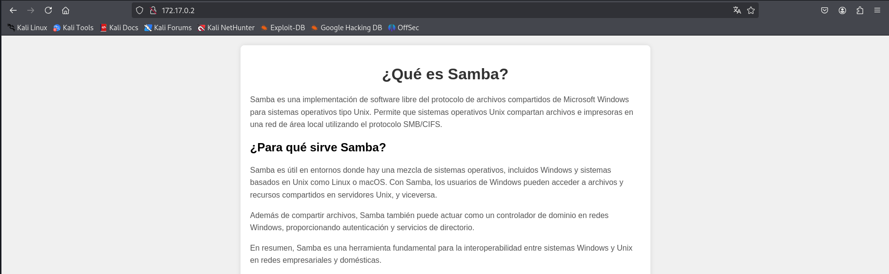

Visto esto ahora sabemos que debemos centrarnos en los puertos Samba para llegar a la solución.

Como no disponemos de ningún potencial usuario, lo primero que haremos una enumeración de recursos, usuarios, etc  con enum4linux

`enum4linux  172.17.0.2`

La herramienta nos detecta dos potenciales usuarios llamados james y bob.

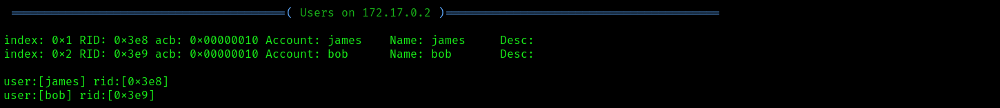

También nos da el nombre de dos carpetas compartidas, una realmente interesante llamada  html.

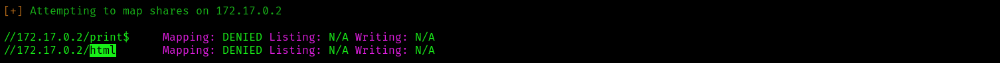

## Explotación de Samba

Intentamos acceder a los recursos compartidos vía smbclient pero nos pide contraseña, también lo probamos con crackmapexec con el password vacío y no nos permite el acceso.

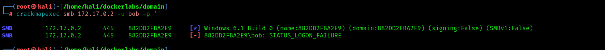

Ahora tenemos usuarios pero no contraseñas así que probamos fuerza bruta con crackmapexec para sacar la contraseña.

`crackmapexec smb 172.17.0.2 -u bob -p /usr/share/wordlists/rockyou.txt` 

Tarda un ratito pero conseguimos el password de `bob:star`

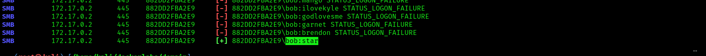

No conseguimos el password de james pero si el de `root:123456`

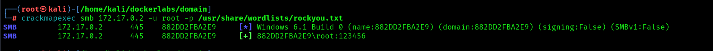

Pero probamos de acceder al recurso y no tenia acceso.

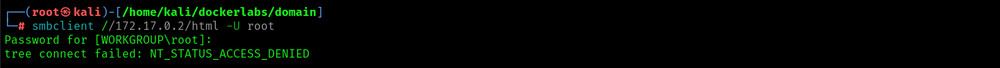

Pero con bob si accedemos a Samba y vemos que allí se encuentra alojada la web, si podemos subir una reverse shell en php nos dará acceso directo al servidor.

Nos dirigimos a la web [https://www.revshells.com/](https://www.revshells.com/) y nos copiamos la PHP revshell de PentestMonckey que siempre funciona muy biena un archivo .php , la subimos a Samba.

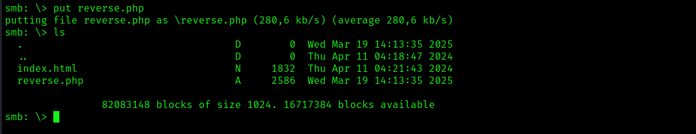

Ponemos netcat a la escucha, y vamos al navegador a buscarla, ya tenemos acceso como www-data.

/acces.png)

Una vez dentro y con el tratamiento de la tty hecho vamos a probar si podemos ser bob, por la vulnerabilidad mas conocidad del mundo, el re aprovechamiento de contraseñas. Ya somos bob.

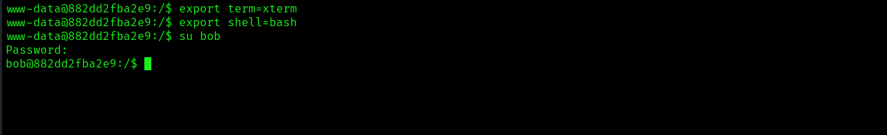

## Escalada de privilegios

Para la escalada probamos sudo -l pero no tiene sudo instalado asi que intentamos con binarios SUID.

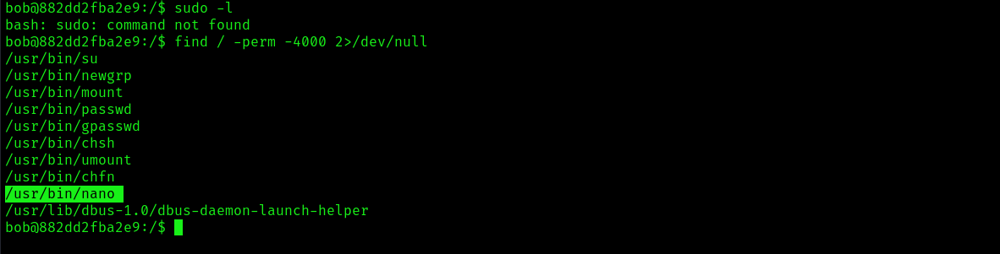

Tenemos permisos especiales para ejecutar nano y son de root.

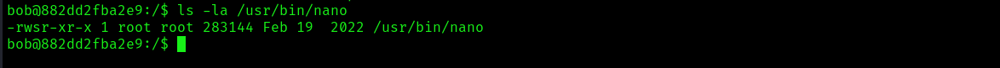

La pagina GTFOBins nos da opciones pero no disponemos del comando sudo así que se nos ocurre modificar el archivo /etc/passwd para cambiar la configuración de root y que este no disponga de contraseña.

Para ello solo tenemos que dejar vacio el campo de la contraseña.

`root::0:0:root:/root:/bin/bash`

Conseguimos la escalada y ya somos root.

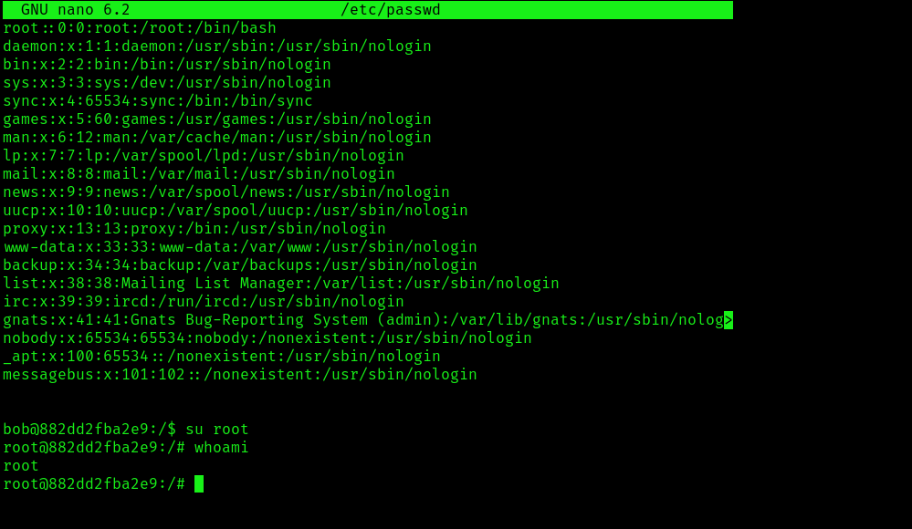
