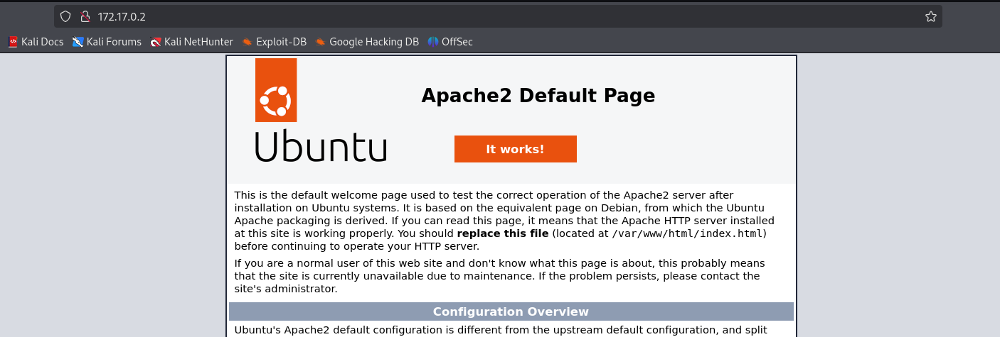
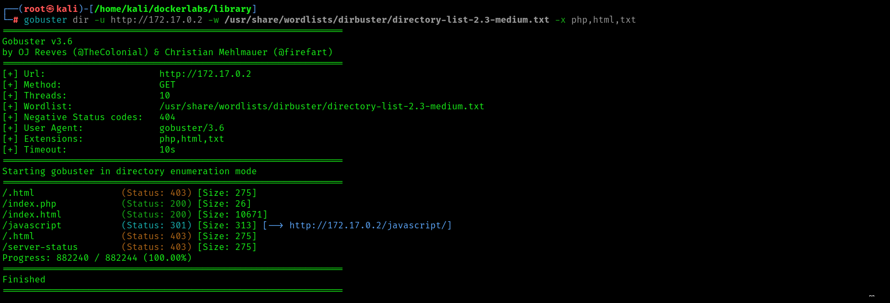
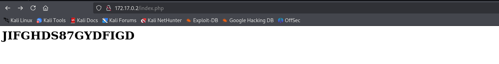
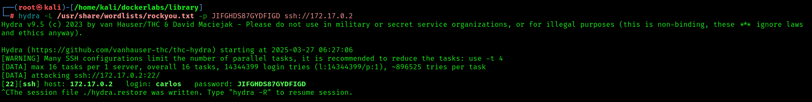
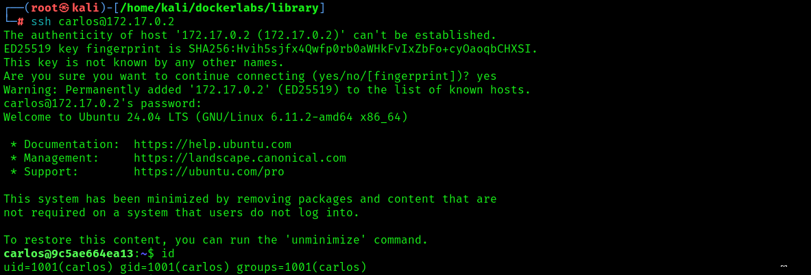
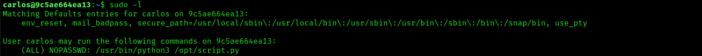
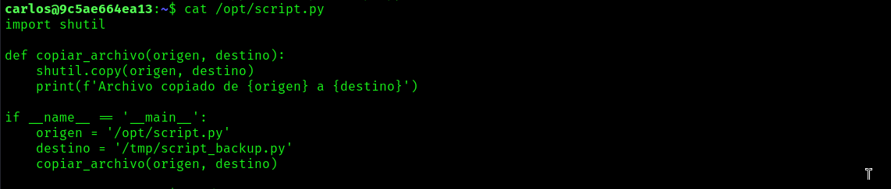

## Library

**Library** es una máquina de DockerLabs en la que hemos utilizado las siguientes técnicas:

1. **Enumeración de directorios ocultos** con Gobuster.
2. **Fuerza bruta** con Hydra.
3. **Escalada de privilegios** utilizando la técnica de **Python library hijacking**.

## Enumeración

Empezamos el reconocimiento de la máquina con un escaneo de puertos abiertos, versiones y vulnerabilidades con `nmap.`

```bash
 # Nmap 7.95 scan initiated Thu Mar 27 06:10:30 2025 as: /usr/lib/nmap/nmap -p- --open -sVC --min-rate 3000 -n -Pn -oN escaneo 172.17.0.2
Nmap scan report for 172.17.0.2
Host is up (0.0000020s latency).
Not shown: 65533 closed tcp ports (reset)
PORT   STATE SERVICE VERSION
22/tcp open  ssh     OpenSSH 9.6p1 Ubuntu 3ubuntu13 (Ubuntu Linux; protocol 2.0)
| ssh-hostkey: 
|   256 f9:f6:fc:f7:f8:4d:d4:74:51:4c:88:23:54:a0:b3:af (ECDSA)
|_  256 fd:5b:01:b6:d2:18:ae:a3:6f:26:b2:3c:00:e5:12:c1 (ED25519)
80/tcp open  http    Apache httpd 2.4.58 ((Ubuntu))
|_http-title: Apache2 Ubuntu Default Page: It works
|_http-server-header: Apache/2.4.58 (Ubuntu)
MAC Address: 02:42:AC:11:00:02 (Unknown)
Service Info: OS: Linux; CPE: cpe:/o:linux:linux_kernel

Service detection performed. Please report any incorrect results at https://nmap.org/submit/ .
# Nmap done at Thu Mar 27 06:10:37 2025 -- 1 IP address (1 host up) scanned in 6.91 seconds
                                                          
```

Tenemos dos puertos abiertos, el puerto 22 donde corre SSH y el 80 por donde parece que corre una pagina de inicio de apache.

Vamos al navegador y confirmamos que si se trata de una página de apache.



Como no parece que haya nada interesante hacemos un poco de fuzzing web para buscar directorios ocultos con gobuster.



Nos llama la atención que existe dos index, uno es php y el otro html, miramos de acceder a index.php y nos encontramos una cadena de números y letras.




## Explotación y fuerza bruta

Intentamos descifrar pero no parece que sea nada encriptado así que se nos ocurre que pueda ser una contraseña. Usaremos `hydra` para buscar posibles usuarios.



Encontramos al usuario Carlos y nos conectamos por SSH.




## Escalada de privilegios

Probamos si tenemos privilegios con `sudo` y nos devuelve que podemos ejecutar un script que se encuentra en /opt como root.




Le echamos un vistazo al script.




El script copia el archivo ubicado en `/opt/script.py` a `/tmp/script_backup.py`. Si ambos archivos existen, el archivo de destino será sobrescrito. Lo primero que miramos es si tenemos permiso de escritura para modificar el script pero no lo tenemos.

Utiliza una librería  llamada shutil, asi que miramos el orden de prioridad del `PATH` de Python con este comando.

`python3 -c 'import sys; print(sys.path)’`

Nos muestra que nuestro directorio actual sera el primero en recorrer para buscar shutil.

Así que vamos a crear un archivo llamado shutil.py donde pondremos:

```bash
import os
os.system("/bin/bash")

```

Este script nos deberia abrir un shell como root.

Le damos permisos de ejecución `chmod +x shutil.py .`

Ejecutamos `script.py` con `sudo.` Ya somos root
