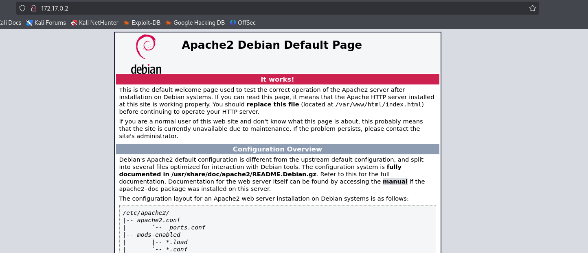
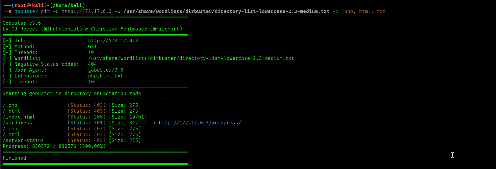

### Walcking CMS (DockerLabs)

Walcking CMS es una maquina fácil de DockerLabs, contiene un wordpress lo que viene muy bien para poder explotar este tipo de CMS.

Técnicas realizadas:

Fuzzing de directorios.

Explotación de wordpress

Escalada de privilegios con binarios SUID

## Enumeracion.

Empezamos con un escaneo de puertos y versiones con nmap.

`nmap -p- --open -sVC --min-rate 3000 -n -Pn  -oN escaneos 172.17.0.3`

```bash
Starting Nmap 7.95 ( https://nmap.org ) at 2025-03-20 07:59 EDT
Nmap scan report for 172.17.0.3
Host is up (0.0000030s latency).
Not shown: 65534 closed tcp ports (reset)
PORT   STATE SERVICE VERSION
80/tcp open  http    Apache httpd 2.4.57 ((Debian))
|_http-title: Apache2 Debian Default Page: It works
|_http-server-header: Apache/2.4.57 (Debian)
MAC Address: 02:42:AC:11:00:03 (Unknown)

Service detection performed. Please report any incorrect results at https://nmap.org/submit/ .
Nmap done: 1 IP address (1 host up) scanned in 7.03 seconds

```
Nmap nos muestra solo un puerto HTTP abierto por el que corre aparentemente un apache con su pagina de inicio.




Como no existe nada mas que este puerto intentaremos hacer un poco de fuzzing de directorios ocultos para encontrar algo mas. Encontramos un directorio llamado wordpress.




Nos encontramos una pagina de wordpress llamada web invulnerable.

Como en todos los wordpress existe un panel de login de administrador en el directorio wp-admin, en esta también.

## Explotación de wordpress

Dado que no disponemos de ninguna credencial ni nombre de usuario usaremos wp-scan para intentar que nos saque algun usuario.

```bash
wpscan --url http;//172.17.0.3/wordpress --enumerate u

```
Encontramos un usuario llamado mario.

Intentamos una verificacion en el panel de login y nos la da.

Podríamos usar hydra para sacar el password del panel de login con  http-post-form pero el mismo wpscan nos lo hace mas fácil.

```bash
wpscan -U mario -P /usr/share/wordlists/rockyou.txt --url http://172.17.0.3/wordpress
```
Wpscan nos saca la contraseña de mario:love

Ya con credenciales validas ya podemos entrar al panel de control de wordpress.

Estamos en el panel de control de wordpress pero lo que queremos es acceder al servidor asi que podemos probar de conseguir una reverse shell en php, para ello usaremos el  **Theme Code Editor** que sirve para editar directamente los archivos de código de un tema, como style.css, functions.php, y otras plantillas.

Para ello buscaremos la plantilla functions.php que nos permite PHP e iremos a la pagina https://www.revshells.com/ a buscar la PHP reverse shell de Pentest Monckey y la añadimos a functions.php le damos a update.

Ahora solo quedara poner netcat a la escucha  al puerto que pusimos la revshell e ir a buscar el directorio functions.php al navegador. Conseguimos acceso al servidor como www-data.

Haremos tratamiento de tty para tener una shell totalmente interactiva.

## Escalada de privilegios

Para la escalada de privilegios sudo no nos sirve porque no esta instalado pero encontramos un binario SUID interesante `/env`. `env` es un comando de Linux que muestra o modifica variables de entorno y puede ejecutar programas en un entorno específico.

Como binario env tiene el bit SUID y pertenece a root lo ejecutaremos para obtener una shell con privilegios elevados con 

```bash
/usr/bin/env /bin/bash -p
```
- `env` ejecuta un programa en un entorno modificado.
- Si tiene SUID, se ejecutará con los permisos del propietario (`root`).
- `p` en Bash evita que los privilegios se bajen automáticamente.

Conseguimos ser root.
